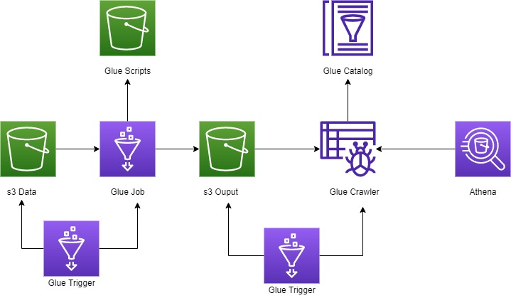

# aws
AWS repository of cool terraform things


# Lake Formation Administrator 

A data lake administrator is an IAM user or IAM role that has the ability to grant any principal (including self) any permission on any Data Catalog resource. Designate a data lake administrator as the first user of the Data Catalog. 

# Lake Formation and Glue

To maintain backward compatibility with AWS Glue, AWS Lake Formation has the following initial security settings:

- The Super permission is granted to the group IAMAllowedPrincipals on all existing AWS Glue Data Catalog resources.
    - The IAMAllowedPrincipals group includes any IAM users and roles that are allowed access to your Data Catalog resources by your IAM policies.
    - The Super permission enables a principal to perform every supported Lake Formation operation on the database or table on which it is granted.

- "Use only IAM access control" settings are enabled for new Data Catalog resources.

These settings effectively cause access to Data Catalog resources and Amazon S3 locations to be controlled solely by AWS Identity and Access Management (IAM) policies. Individual Lake Formation permissions are not in effect.

Lake Formation starts with the "Use only IAM access control" settings enabled for compatibility with existing AWS Glue Data Catalog behavior. We recommend that you disable these settings to enable fine-grained access control with Lake Formation permissions. [See Steps](https://lakeformation.workshop.aws/lakeformation-basics/default-catalog-settings.html)


[Trouble Shooting Lakeformation Issues](https://forums.aws.amazon.com/thread.jspa?threadID=308890)

[Rolling back Lakeformation Permissions](https://github.com/aws-samples/aws-glue-samples/tree/master/utilities/use_only_IAM_access_controls)


# AWS Glue Job 
[Blog](https://aws.amazon.com/blogs/big-data/building-an-aws-glue-etl-pipeline-locally-without-an-aws-account/)



## Install docker image
Pull docker image 
   `docker pull amazon/aws-glue-libs:glue_libs_1.0.0_image_01`

## Running Locally  

### Running pyspark 

1. Start the container in the background
```
docker run -itd \
-v ${PWD}/scripts:/scripts \
-v ${PWD}/data:/data \
-v ${PWD}/output:/output \
--name glue amazon/aws-glue-libs:glue_libs_1.0.0_image_01
```

2. execute a bash on the container 

`docker exec -it glue bash`

3. Start pyspark execution 
`/home/spark-2.4.3-bin-spark-2.4.3-bin-hadoop2.8/bin/pyspark`

**OR**

3. Run glue jobs within the container
```
/home/spark-2.4.3-bin-spark-2.4.3-bin-hadoop2.8/bin/spark-submit /scripts/job1.py \
--JOB_NAME "local_test" \
--OUTPUT_SRC "output" \
--INPUT_SRC "Salaries.csv" \
--SRC_TYPE "csv" \
--ENV "local" \
--OUTPUT_FORMAT "csv" \
--CONN_TYPE "s3"
```
### Running Jupyter notebook 

Start the container using the following command 

```
docker run -itd -p 8888:8888 -p 4040:4040 \
-v ~/.aws:/root/.aws:ro \
-v ${PWD}/scripts/:/home/jupyter/jupyter_default_dir/scripts \
-v ${PWD}/data/:/home/jupyter/jupyter_default_dir/data \
--name glue_jupyter amazon/aws-glue-libs:glue_libs_1.0.0_image_01 /home/jupyter/jupyter_start.sh
```


### References 
[Working with AWS Glue Container]
[Builindg glue pipline localy](https://aws.amazon.com/blogs/big-data/building-an-aws-glue-etl-pipeline-locally-without-an-aws-account/)

[Glue Connection Types](https://docs.aws.amazon.com/glue/latest/dg/aws-glue-programming-etl-connect.html). Note when running Glue localy we specify `s3` as connection type with `POSIX` path argument.  

[glue versions](https://docs.aws.amazon.com/glue/latest/dg/release-notes.html)

[Glue Format Options](https://docs.aws.amazon.com/glue/latest/dg/aws-glue-programming-etl-format.html)


Start the notebook in your browser by visiting the address `http://localhost:8888`

**NOTE** Ensure you run a pyspark shell within jupyternotebook when working with the glue context

Jupyter notebook home directory 

`/home/jupyter/jupyter_default_dir`

## Workflow Overview

When you author a job, you supply details about data sources, targets, and other information. The result is a generated Apache Spark API (PySpark) script. You can then store your job definition in the AWS Glue Data Catalog.

The following describes an overall process of authoring jobs in the AWS Glue console:

Choose the type of Job you want to run within AWS Glue. There are various types to choose from: 
- **Python Shell**
    - You can run script that are compatible with Python 2.7 or Python 3.6
    - You can't use job bookmarks with Python shell jobs
    - output of cloudwatch logs are stored `/aws-glue/python-jobs/output` and for errors `/aws-glue/python-jobs/error`
- **Streaming ETL Jobs**
    - consume data from streaming source like Amazon Kinesis, Apache Kafka and store data to s3 or JDBC data stores
    - processes and writes out data in 100 second windows
    - ues checkpoints to track the data that has been read. 
    - billed hourly for streaming 

You choose a data source for your job. The tables that represent your data source must already be defined in your Data Catalog. If the source requires a connection, the connection is also referenced in your job. If your job requires multiple data sources, you can add them later by editing the script.

You choose a data target of your job. The tables that represent the data target can be defined in your Data Catalog, or your job can create the target tables when it runs. You choose a target location when you author the job. If the target requires a connection, the connection is also referenced in your job. If your job requires multiple data targets, you can add them later by editing the script.

You customize the job-processing environment by providing arguments for your job and generated script. For more information, see Adding Jobs in AWS Glue.

Initially, AWS Glue generates a script, but you can also edit this script to add sources, targets, and transforms. For more information about transforms, see Built-In Transforms.

You specify how your job is invoked, either on demand, by a time-based schedule, or by an event. For more information, see Starting Jobs and Crawlers Using Triggers.

Based on your input, AWS Glue generates a PySpark or Scala script. You can tailor the script based on your business needs. For more information, see Editing Scripts in AWS Glue.

# Triggers
  